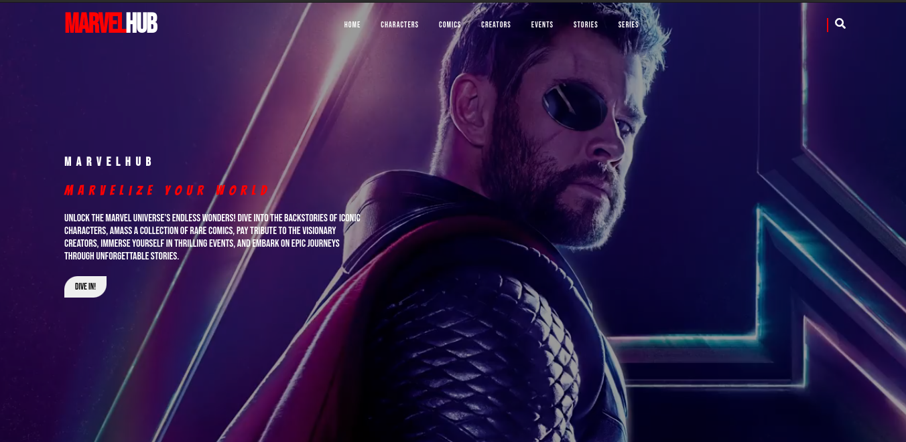
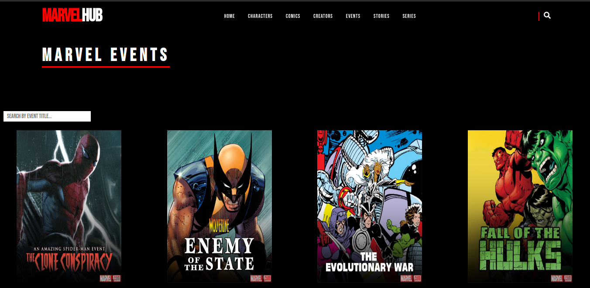

# MarvelHub

A React website that uses the Marvel Developer API fetch Marvel characters, comics, stories, creators and events.

## Getting Started

## Table of contents

- [Overview](#overview)
  - [The challenge](#the-challenge)
  - [Screenshot](#screenshot)
  - [Links](#links)
- [My process](#my-process)
  - [Built with](#built-with)
  - [What I learned](#what-i-learned)
  - [Continued development](#continued-development)
- [Author](#author)

## Overview

### The challenge

Users should be able to:

- See all marvel characters, comics, events, series and stories.
- See a single character in its own page once its clicked.
- Search for characters, comics, events and stories.

### Screenshot

Home Page

Data Page

### Links

- Live Site URL: [MarvelHub](https://academiccmacharia.github.io/MarvelHub/)

### Built with

- Semantic HTML5 markup
- CSS custom properties
- Flexbox
- CSS Grid
- Desktop-first workflow
- [React](https://reactjs.org/) - JS library
- [CSS File](https://styled-components.com/) - For styles

### What I learned

Over the course of this project I was able to carry some things with me. I learned about fetching data using APIs, particularly using axios andn I also learnt how to implement a search functionality in that is able to search through the data fetched.

### Continued development

1. Implement hamburger button.
2. Data fetching when hosting.

## Author

- Website - [Portfolio(new version coming soon!)](https://academiccmacharia.github.io/ePortfoliov1/)
- Frontend Mentor - [Ben Macharia](https://www.frontendmentor.io/profile/AcademiccMacharia)
- LinkedIn - [Ben Macharia](https://www.twitter.com/yourusername)